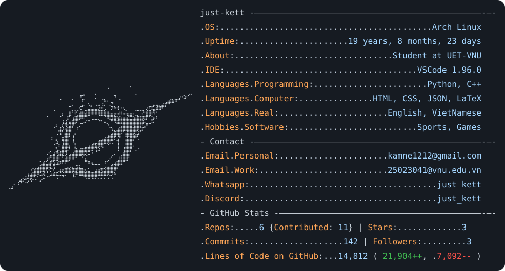

<a href="https://github.com/just-kett/just-kett">
  <picture>
    <source media="(prefers-color-scheme: dark)" srcset="dark_mode.svg">
    
  </picture>
</a>

  <a href="https://github.com/just-kett">
  

